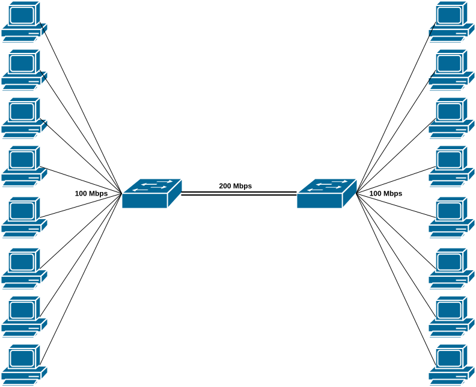
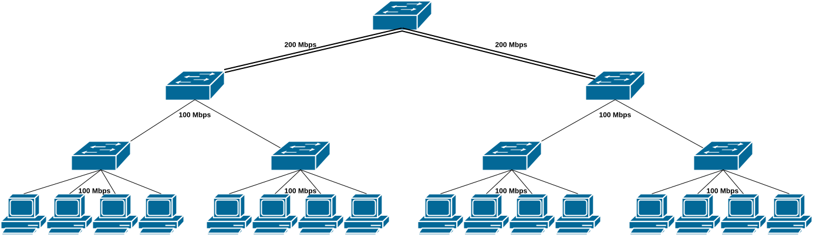

# Dynamic Bandwidth Allocation in Software Defined Networks

## Introduction
This repository contains the code for two Mininet topologies (extended-star, three-tier tree) and two Ryu SDN Controller Algorithms (max-min fair share allocation, proactive algorithm). 

## Topologies
### Extended star topology
Characteristics: 
- 2 switches
- 16 hosts (8 per switch)
- 200 Mbps link between switches
- 100 Mbps links between hosts and their switch

### Three tier tree topology
Characteristics: 
- 7 switches: 1 core, 2 aggregation, 4 edge
- 16 hosts (4 per edge switch)
- 200 Mbps links between the core and aggregation switches
- 100 Mbps links between the aggregation switches and edge switches, and between the edge switches and hosts

