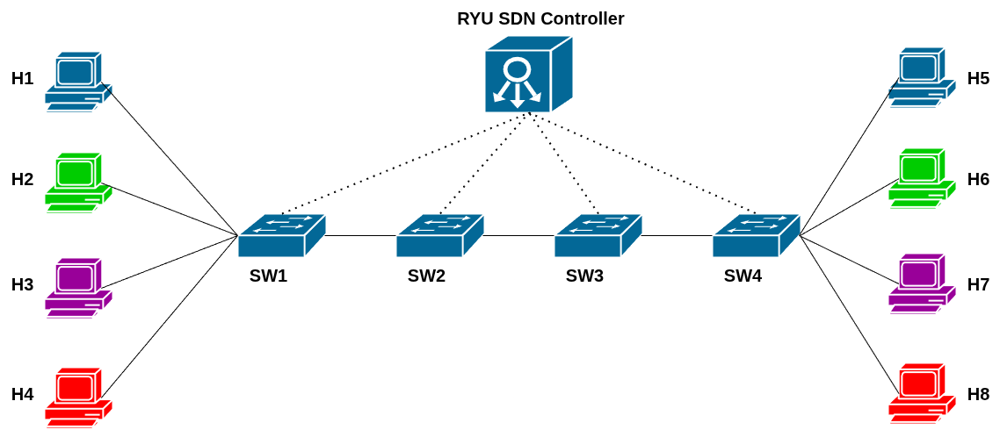
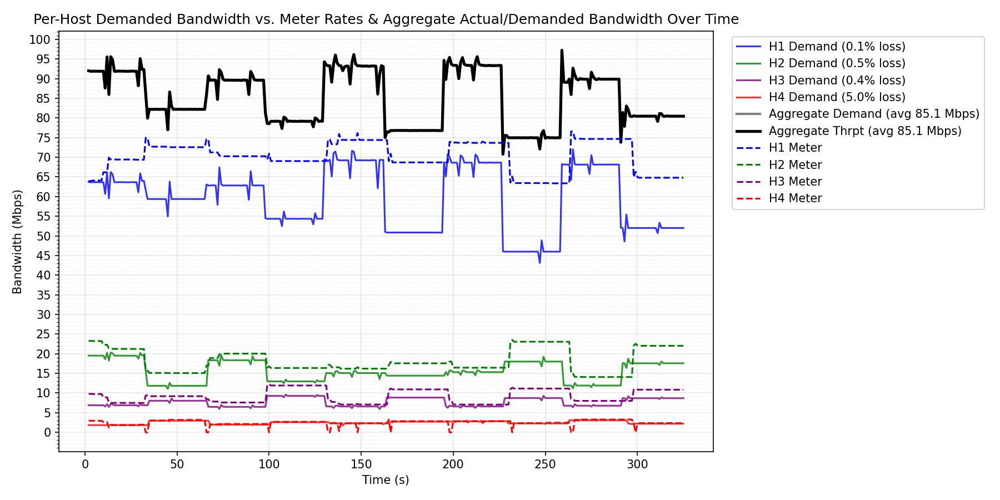
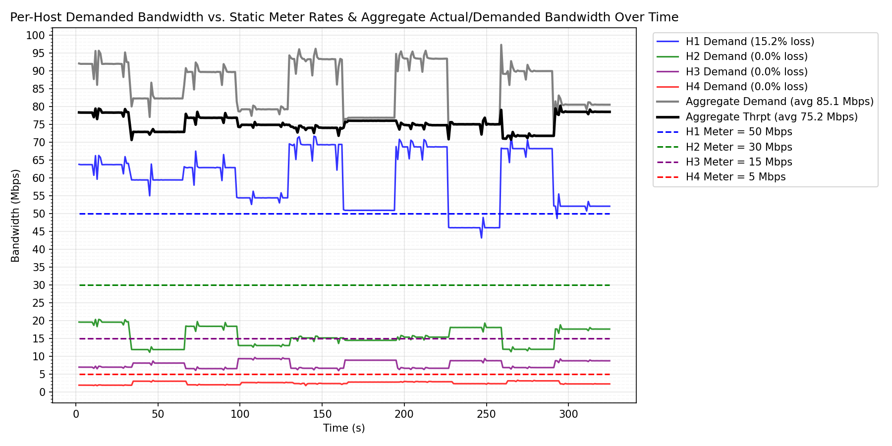

# Dynamic Bandwidth Allocation in Software Defined Networks

## Introduction
This repository contains the code for the Bachelor Thesis "Dynamic Bandwidth Allocation in Software Defined Networks using OpenFlow meters".

## Components
- `src/allocation_app.py` - Ryu SDN Controller: contains the updated AFQoS DBA algorithm introduced by Deo et al. 
- `src/qostopo.py` - Mininet topology and simulation tests: contains the Mininet topology setup and the traffic tests logic.
- `src/format_server_output_csv.py` - used to format the server-side iperf csv output into a normalized format that can be used for plotting.
- `src/make_graphs_dba.py` - used to plot the AFQoS DBA experiments, including demanded bandwidth for each host over time, meter rates for each host over time, aggregate throughput and aggregate demand. It also includes loss percentages per class and aggregate/demanded Mbps in the legend.
- `src/make_graphs_fixed_allocation.py` - same plotting as previous component, but used for plotting QoS fixed allocation instead of DBA.
- `src/fairness.py` - used for computing Jain's weighted fairness index from the formatted serverside iperf csv output
- `src/monitor_usage.py` - script that polls the resource usage for the ryu-manager process and outputs a csv with timestamp, CPU usage, RSS and VMS memory usage that is used for computing controller overhead.
- `src/calculate_usage_percentages.py` - script that computes the average CPU, RSS and VMS memory usage from the csv output of `monitor_usage.py`
- `src/Results/Logs` - contains the iperf csv data from client side, server side and formatted server side for each of the 9 experiments
- `src/Results/Graphs` - contains the graphs for each of the 9 test cases, both for AFQoS DBA and static QoS allocation
- `src/ryu.conf` - config file for Ryu SDN controller in order to save logs to ryu.log


## Prerequisites
- [Mininet](https://mininet.org/download/)  ; install it as a VM, then ssh into it via `ssh mininet@<mininet-vm-ip>` with password `mininet` or set-up ssh keys
- [Ryu](https://ryu.readthedocs.io/en/latest/getting_started.html): 
    - Install via `pip install ryu` on the VM running Mininet

## Running the experiments
- Copy the `dba_in_sdn` directory on the Mininet VM
- SSH into mininet
- Run the Ryu SDN Controller 
- Open another terminal in mininet and run the experiments

Commands (fill in the IP address of the mininet-vm):
```bash
teo@ubuntu:~$ scp -r dba_in_sdn mininet@<mininet-vm-ip>:~/

teo@ubuntu:~$ ssh mininet@<mininet-vm-ip>

mininet@mininet-vm:~$ cd dba_in_sdn/src

mininet@mininet-vm:~/dba_in_sdn/src/$ ryu-manager --config-file ryu.conf allocation_app.py ryu.app.ofctl_rest

# In another terminal, start the experiments
teo@ubuntu:~$ ssh mininet@<mininet-vm-ip>

mininet@mininet-vm:~$ cd dba_in_sdn/src

mininet@mininet-vm:~/dba_in_sdn/src$ sudo python3 qostopo.py

# When the experiments are done, retrieve the csv logs
teo@ubuntu:~$ scp mininet@<mininet-vm-ip>:~/dba_in_sdn/src/Results/Logs/*.csv ~/dba_in_sdn/Results/Logs

# Make a venv and install matplotlib, pandas, numpy, format the output and plot
(.venv) teo@ubuntu:~/dba_in_sdn/src/$ python3 format_server_output_csv.py; python3 make_graphs_dba.py 

# Graphs will the generated under `src/Results/Graphs`
```

## Mininet topology
- 8 hosts:
    - 4 clients (H1-H4)
    - 4 servers (H5-H8)
- each client sends traffic to his corresponding server (1-to-1 mapping)
- each client sends one type of QoS traffic
- 100 Mbps links, 1 ms delay
- 4 OpenFlow 1.3 enabled switches
- AFQoS DBA is performed only on SW2




## Results example - Case 7

### Using AFQoS DBA

Case 7 is a strong case for our AFQoS DBA algorithm, and is one in which H1 is overperforming its initial meter by 20% while H2, H3, and H4 are underperforming by 50%. The extra room in lower priority classes allows H1 to grow and meet its extra demand, lowering packet loss in H1 to a negligible 0.1%. The static QoS Allocation, as you will see below, results in 15.2% packet loss for H1.

### Using Static QoS Allocation

